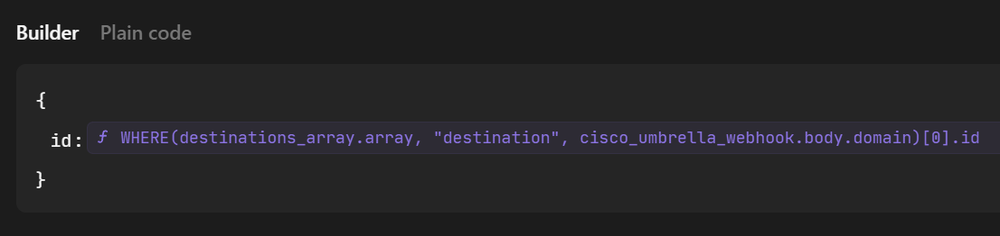
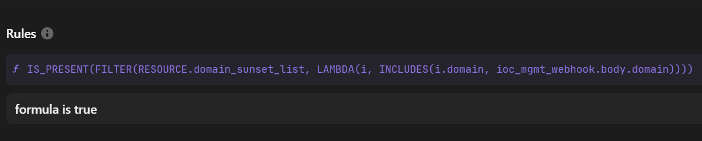

## Automate Blocking Domains in Cisco Umbrella with Tines
For Security Operations, IOC management is a challenge.  

How does one team with limited time and resources track Indicators of Compromise (IOCs) in all their security solutions and lifecycle them appropriately?  

Tines makes this challenge much easier through their SOAR automation platform.

This past month, we launched a Tines webform, where a security analyst can add IOCs to all our backend security solutions.  In addtion, a ServiceNow incident is logged, along with sharing the IOCs with our partner institutions via MISP, the open-source threat intel sharing platform.

With the IOC blocking webform project, I worked with the Cisco Umbrella API for the first time. 
## A Cisco Umbrella Destination 

Cisco Umbrella defines a destination as a :
1. domain, 
2. URL, 
3. or IP address.   

In this Tines Story, I blocked domains.

## API Scope
For adding an IOC to the global blocklist, the API key pair needs to have read/write access to Policies/Destination Lists.

## Cannot query the Cisco Umbrella ID

It is straightforward to add a destination to Umbrella using the Tines Cisco Umbrella template, but to remove the IOC is a challenge since there is no way query the Umbrella destination lists endpoint for the destination's Umbrella ID.

In order to remove a destination, the workflow builds the entire list of Umbrella IDs that are in the block list.  From that array, you can use the following WHERE function to obtain the Umbrella ID:

Under the [tines](story) folder, I include the pagination loop for building the array in order to obtain the destination's Umbrella ID.

In addition, I have two workflows which manage the entire lifecycle of the blocked destination.  The first workflow adds the blocked destination to a sunset list.  The second one filters the sunset list for blocked destinations older than 90 days, which can be changed.

## A Trigger action to check the sunset list prior to removing it from the Tines Resource.
While performing quality checks on the workflow, I selected the Remove action from the webform instead of the Add action.  When the domain IOC was sent to the IOC management workflow, it generated a null value when checking for the index of the IOC.  For some reason, the Tines action removed a random domain from the sunset list.  

I use this trigger to prevent this from happening:

I hope you found this useful.

Once you start automating, you cannot stop.

Happy Building!

Tom

## Tines Technical Resources
- [FREE Tines Community Edition](https://www.tines.com/pricing/)
- [Tines Documentation](https://www.tines.com/docs/quickstart/)
- [Tines Tutorials](https://www.tines.com/customer-center/#tutorials)
- [Tines Customer Center](https://www.tines.com/customer-center/)
- [Tines University](https://www.tines.com/university/)
- [Tines & AI](https://www.tines.com/product/ai/)
- [Tines WHERE Function](https://www.tines.com/docs/formulas/functions/where/)

## Cisco Technical Resources
- [Cisco Umbrella Sign Up](https://signup.umbrella.com/)
- [Cisco Umbrella API Docs](https://developer.cisco.com/docs/cloud-security/getting-started/)

## MISP
- [GitHub Repo](https://github.com/MISP/MISP)
- [MISP Documentation](https://www.misp-project.org/documentation/)